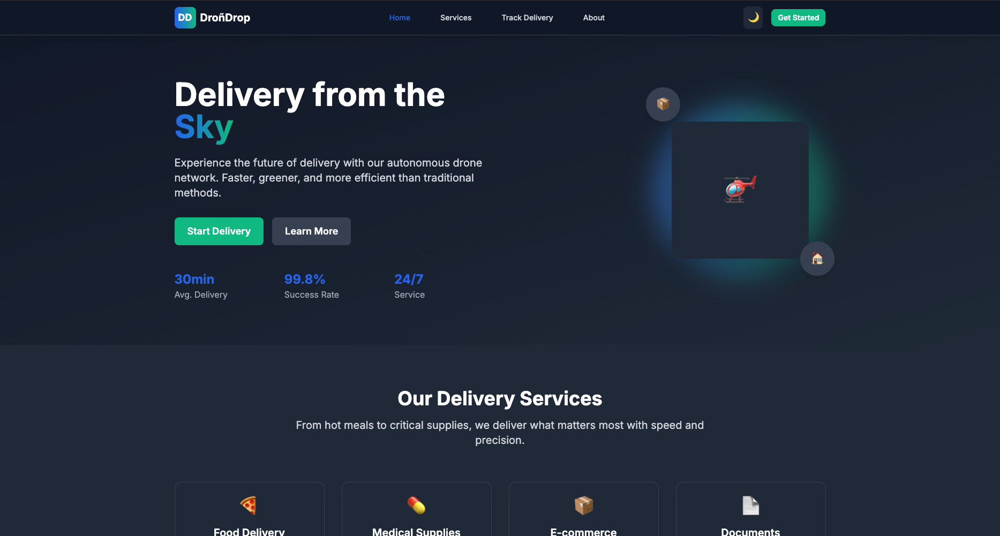

# DroñDrop - Drone Delivery Service 🚁

A modern React.js application for scheduling drone deliveries, built with Vite, Tailwind CSS, and React Router.



## 🚀 Live Demo

[View Live Application](https://drondrop.vercel.app) 

## 📋 Features

- **Multi-step Order System** - Intuitive drone delivery scheduling
- **Real-time Tracking** - Live package tracking with status updates
- **Service Selection** - Food, medical supplies, and e-commerce delivery options
- **Dark/Light Mode** - Theme switching with persistent preferences
- **Responsive Design** - Optimized for mobile, tablet, and desktop
- **Interactive UI** - Modal-based ordering flow with form validation

## 🛠️ Tech Stack

- **Frontend:** React 18, JSX
- **Styling:** Tailwind CSS
- **Routing:** React Router DOM
- **Build Tool:** Vite
- **Deployment:** Vercel

## 🏗️ Project Structure

```
src/
├── components/
│   ├── UI/           # Reusable components (Button, Card, Modal)
│   ├── Layout/       # Navbar, Footer, Layout
│   └── Sections/     # Homepage sections
├── pages/            # Route components
├── hooks/            # Custom React hooks
├── context/          # Theme context provider
├── utils/            # Helper functions
└── App.jsx           # Main application component
```

## 🚀 Getting Started

### Prerequisites
- Node.js (v18 or higher)
- npm or yarn

### Installation

1. **Clone the repository**
   ```bash
   ñ
   ```

2. **Install dependencies**
   ```bash
   npm install
   ```

3. **Start development server**
   ```bash
   npm run dev
   ```

4. **Open your browser**
   - Navigate to `http://localhost:5173`

### Available Scripts

- `npm run dev` - Start development server
- `npm run build` - Build for production
- `npm run preview` - Preview production build

## 🎯 Key Implementation Details

### State Management
- **React Hooks:** useState, useEffect, useContext
- **Custom Hooks:** useLocalStorage for persistence
- **Context API:** Theme management (light/dark mode)

### Component Architecture
- **Reusable UI Components:** Button, Card, Modal
- **Layout Components:** Responsive Navbar and Footer
- **Page Components:** Home, Services, Tracking, About

### API Integration
- Mock API simulation for order processing
- Real-time tracking system
- Form validation and error handling

### Styling
- **Tailwind CSS** with custom configuration
- **Dark mode** support with system preference detection
- **Responsive design** using mobile-first approach
- **Custom animations** and transitions

## 📱 Pages Overview

- **Home:** Hero section, services showcase, how-it-works
- **Services:** Service selection with interactive ordering modal
- **Tracking:** Real-time package tracking interface
- **About:** Company information and team details

## 🚀 Deployment

This application is deployed on **Vercel** for optimal performance:

1. **Automatic deployments** from GitHub
2. **Global CDN** for fast loading worldwide
3. **HTTPS enabled** by default
4. **Continuous deployment** on git push

## 👨‍💻 Development

### Adding New Features
1. Create components in appropriate directories
2. Follow existing patterns for state management
3. Use Tailwind CSS for styling
4. Test responsive behavior

### Code Style
- Functional components with hooks
- Descriptive component and variable names
- Consistent formatting with ESLint

## 📄 License

This project was created as part of a React.js and Tailwind CSS assignment.

## 🤝 Contributing

1. Fork the project
2. Create your feature branch
3. Commit your changes
4. Push to the branch
5. Open a Pull Request

---

**Built with ❤️ using React.js and Tailwind CSS**
```

## Quick Deployment Steps Summary:

1. **Push to GitHub:**
   ```bash
   git init
   git add .
   git commit -m "Initial deployment"
   git branch -M main
   git remote add origin https://...   
   git push -u origin main
   ```

2. **Deploy to Vercel:**
   - Go to [vercel.com](https://vercel.com)
   - "Import Project" → Select your repo
   - Click "Deploy" (takes 1-2 minutes)
   - Copy the provided URL and add it to your README.md

Your app will be live and loading super fast! 🚀